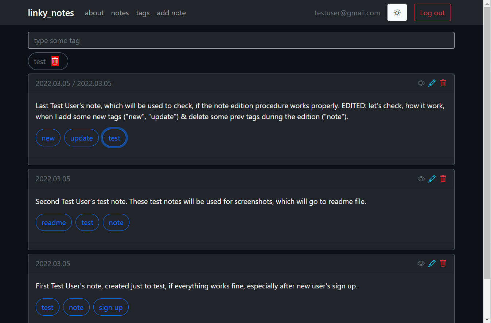

# linky_notes

*linky_notes* allows you to create & organize notes with tags (soon with references too). Try the app here: https://vadimgierko.github.io/linky-notes/

Thanks to that:
- your notes are linked with each other by keywords
- they are grouped by tags (& sources in a few days...)
- the note can have few tags, so it would be in a few keywords groups
- you don't need to put notes in folders or do any index or table of content
- that is easy to find the particular note by choosing keywords they consist in search field
- you are saving a tone of time to organize & efficiently use them

### `NOTE! At the moment (from 23.02) I'm adapting this app to a new architecture, data layer management pattern & security rules. From 05.03 you can sign up, add, edit & delete notes, add & delete tags to them, but not adding the source. I rebuild the app basically from scratch, and now it's available not only for my personal use, like it was before, but for everyone! You can add your notes at the moment, and when I add "add source" feature, you can just update your notes.`

## Motivation

I've made this app first of all for myself. I read a lot, create a lot and... do a lot notes. I couldn't manage hunderds of my notes, so I've decided to build this app. And I'm very proud, that finally, after one year of learning web development, I've solved one of my biggest problems thanks to my own app. Now my notes will be tagged, organized & easy to filter.

## What you can do with the app at the moment

- sign in/up
- **add, update & delete notes** when logged
- add & delete **tags** for the notes or leave it without the tags
- ~~add & delete **source** for my notes or leave it without the source~~ (comming soon - after massive rebuild from scratch, I need some time to rebuild & add the feature once again)
- **search/ filter notes by tag/ tags**
- searching mechanism generates link for each searching session, so:
  - you can navigate beetween searching sessions
- switch dark/ light mode

### Technologies I've used in this project:
- React 17
- React Router 5.2
- React Context & useContext
- Firebase 9.1 (authentication, realtime database, storage)
- Bootstrap 5.1