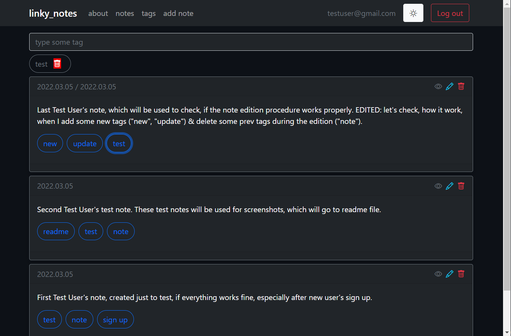

# linky_notes

CREATE, ORGANIZE & FILTER your NOTES BY TAGS with *linky_notes*!
**Sign up & try** the app **for free** here: https://vadimgierko.github.io/linky-notes/

Thanks to that:
- your notes are linked with each other by keywords
- they are grouped by tags (& sources in a few days...)
- the note can have few tags, so it would be in a few keywords groups
- you don't need to put notes in folders or do any index or table of content
- that is easy to find the particular note by choosing keywords they consist in search field
- you are saving a tone of time to organize & efficiently use them

### `NOTE!`

From 23.02 to 05.03 I adapted this app to a new architecture, data layer management pattern & security rules taken from my template starter app. Now you can **sign up, add, edit & delete notes, add & delete tags to them & filter notes by tags**. I rebuild the app basically from scratch, and **now it's available for everyone** and not only for my personal use, like it was before.

From 06.03. I started working on rewriting add source/references features from scratch (I had this functionality before, but it was...) So, You can add your notes at the moment, but without a reference. When I add "add/edit source" feature, you can just update your notes.

While I was thinking about how to adapt this new rebuilt feature, I've understood, that I need to have more reusable & customizable components, so all my work on addSource features became a playing background & test enviroment for new ideas. That's why it's so log, but... I make progress & simplified a lot of other components, so when the feature will be ready, I plan to apply these reusable & customizable components to all app, what means that I would rebuild the app again... and I did it partially already ;-)

But don't worry, these under-the-hood changes will not impact on your experience of using this app!

## Motivation

I've made this app first of all for myself. I read a lot, create a lot and... do a lot notes. I couldn't manage hunderds of my notes, so I've decided to build this app. And I'm very proud, that finally, after one year of learning web development, I've solved one of my biggest problems thanks to my own app. Now my notes will be tagged, organized & easy to filter.

## What you can do with the app at the moment

- sign in/up & log out
- **add, update & delete notes** when logged
- add & delete **tags** to/from the notes or leave it without tags
- ~~add & delete **source** for my notes or leave it without the source~~ (comming soon - after massive rebuild from scratch, I need some time to rebuild & add the feature once again)
- **search/ filter notes by tag/ tags**
- searching mechanism generates link for each searching session, so:
  - you can navigate beetween searching sessions
- switch dark/ light mode

### Technologies I've used in this project:
- React 17
- React Router 5.2
- React Context & useContext
- Firebase 9.1 (authentication, realtime database, storage)
- Bootstrap 5.1

----------------------------------------------------------------------------------------
## currently working on (that's a TODO checklist for myself):

Currently (from 07.03.2022) I'm working on developing & applying notes sources (references) features, so when I finish, **you'll be able to**:
- [ ] add (+ edit & delete) a reference to the source of your note (you can cite a book or an article from the web etc.)
- [ ] click a reference in note card footer to see the full information about the cited source (source card)
- [ ] filter notes by sources or authors
- [X] see the list of all of your sources in database
- [ ] add, edit & delete sources independently from the note/s on dedicated add-source page

The result of this big complex feature implementation will be ~~**new components** listed below:~~
~~- [ ] SourceSearchForm~~
~~- [ ] SourceSearchFormSelect => like TagSearchForm it generates a search link on ItemsPage or add source to the note during the note edition~~
~~- [ ] SourceForm (for adding & deleting the source)~~
 ~~- [ ] AuthorForm (for adding a new author)~~
~~- [ ] Sources (page)~~
~~- [ ] SourcesList~~
~~- [ ] SourceCard => when clicked filter notes that cite this source~~
~~- [ ] Authors (page)~~
~~- [ ] AuthorsList~~
  ~~- [ ] AuthorCard => when clicked filter notes that cite this author~~

**new reusable & customizable components** used in the whole app:
- [ ] Form
  - [X] creeating new item object
  - [ ] updating passed item object passed via props
  - [ ] rendering many different form control types
  - [ ] rendering additional custom components
- [X] List
- [X] Card

The **database structure for sources & authors** will be:

"authors": {
  "$uid": {
    "list": {
      "$authorKey": {
        "firstName": "",
        "lastName": "",
      }
    },
    "$authorKey": {
      "metadata": {
        "firstName": "",
        "middleName": "",
        "lastName": "",
      }
      "works": {
        "$sourceKey": "sourceTitle",
        "$sourceKey": "sourceTitle",
      }
    }
  }
},
"sources": {
  "$uid": {
    "list": { //===========> we need list of all sources to generate keys in order of addition
      "$sourceKey": "sourceTitle",
      "$sourceKey": "sourceTitle"
    },
    "books": {
      "list": { //==================> each source type / category has its own list
        "$sourceKey": "sourceTitle",
        "$sourceKey": "sourceTitle"
      },
      "$sourceKey": {
        "authors": {
          "$authorKey": "lastName",
        }
        "title": "",
        "subtitle": "",
        "publisher": "",
        "placeOfPublication": "",
        "yearOfPublication": "",
      }
    },
    "webpage": { //========= webpage === article, blog article
      "list": {
        "$sourceKey": "sourceTitle",
        "$sourceKey": "sourceTitle"
      },
      "$sourceKey": {
        "authors": {
          "$authorKey": "lastName",
        }
        "title": "",
        "subtitle": "",
        "webpage/blogName": "",
        "dateOfPublication": "",
        "dateOfUpdate": "",
        "accessedAt": "",
        "URL": ""
      }
    },
    "$anyOtherSourceType": {
      "list": {
        "$sourceKey": "sourceTitle",
        "$sourceKey": "sourceTitle"
      },
      "$sourceKey": {
        ...source
      }
    }
  }
}

Prev security rules:
{
  "rules": {
    "$anyItemType": { // sources, tags, notes, ...users, etc.
      "$uid": {
        ".read": "auth != null && auth.uid == $uid",
        ".write": "auth != null && auth.uid == $uid"
      }
    },
  }
}